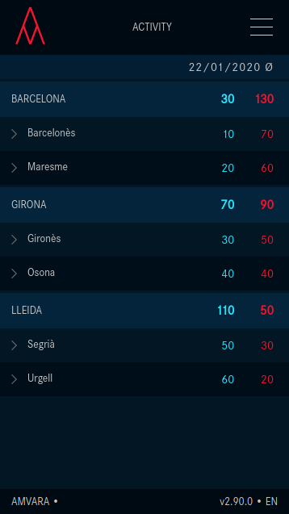
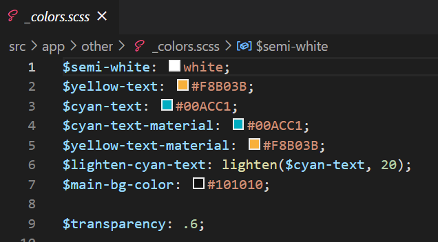
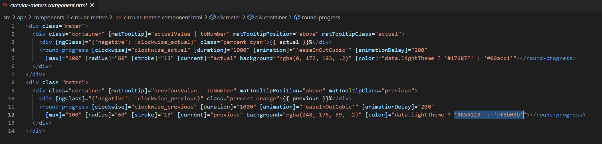
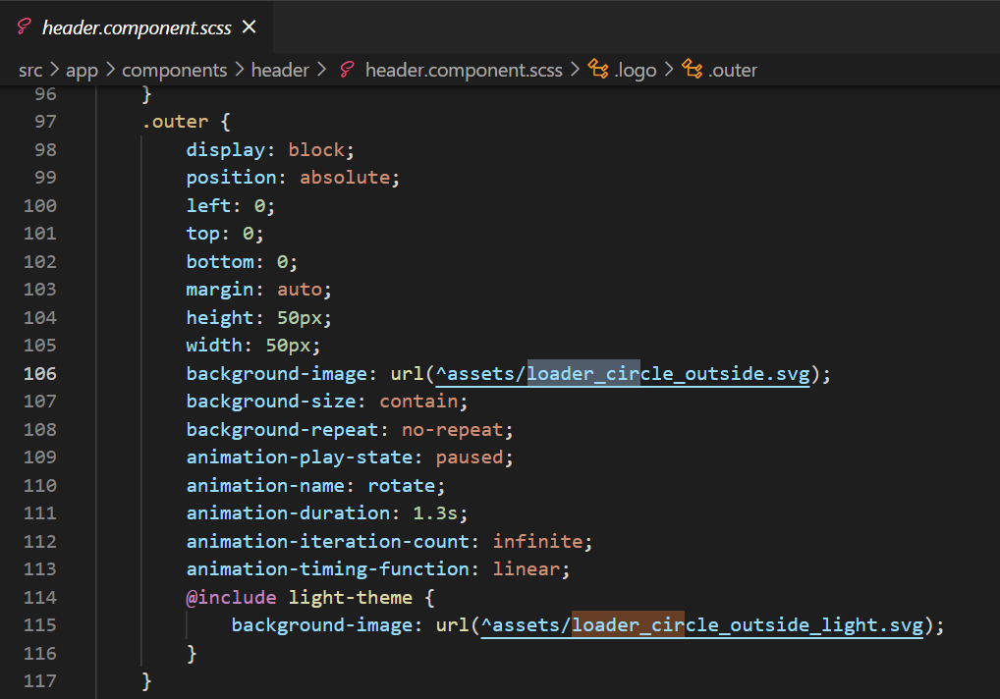
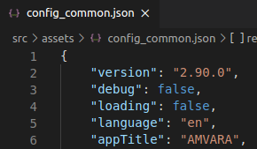
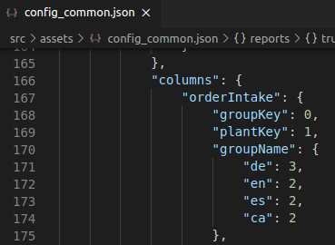

         

# Table of contents
1. [What is BAP?](#BAP)
2. [Installation and deployment](#InstallDeploy)
3. [Skinning](#Skinning)
    1. [Colors](#Colors)
    2. [Graphs](#Graphs)
    3. [Text](#Text)
    4. [Logo](#Logo)
    5. [Routing](#Routing)
    6. [App title and loading screen](#AppTitle)
4. [Translation](#Translate)
    1. [Add new language](#NewLanguage)
    2. [Translate text](#TranslateText)
    3. [Translate data](#TranslateData)
5. [Input data](#Data)
6. [Support](#Support)
  

# 1. What is BAP?

BAP is an interactive dashboard that displays all the data contained in a CSV file in a matter of seconds, granting incredibly low FCP (First Contentful Paint) and TTI (Time To Interactive). Furthermore, our dashboard offers to the user a broad range of different graphics and data display options combined with an atractive and totally customizable interface.

### Desktop view

### Mobile view

# 2. Installation and deployment

# 3. Skinning
In this point we will explain you how to customize the app to your own needs.

## 3.1 Colors
BAP colors can be changed in "./src/app/other/_colors.scss". In said file you can change both color codes and variable names. Furthermore, you can change the previous variables in the respective .scss file.

## 3.2 Graphs
The same way as with the colors, you can change the colors of the graphics. Some of them can be directly modified in the _colors.scss file, while others have to be edited in the .html file containing them.

## 3.3 Text
Changing the text is pretty easy. If you want to hardcode text, go to its respective .html file and change it from there. However, if you want to insert translated text, you can go to point 3 to see how to do so.

## 3.4 Logo
You can change the wepbage logo in the "./src/app/components/header/header.component.scss" file. You should keep in mind that the original logo is divided in 3 parts(outer, middle and inner). If you don't want to follow this structure, just put display:hidden in the property you want to hide. If you want to keep the rotating animation, you will also need to adapt the height and width properties to your image scale.

## 3.5 Routing

## 3.6 App title and loading screen
The app title can be modified in "./src/assets/config_common.json" changing the "AppTitle" variable to the name of your application. To change the loading screen title, head to "./src/index.html" and put it inside the "title" div.

# 4. Translation
BAP offers the user the ability to translate the webpage into whatever language. To do so, follow the steps:

## 4.1 Add new language
To add and use a new language in BAP go to "./src/assets/config_common.json". In said file, the variable 'languageCodes' contains all the languages the user is going to use. Add the code of the new language. [Click here](https://en.wikipedia.org/wiki/List_of_ISO_639-1_codes) to see all the language codes.

## 4.2 Translate text
Once you have added anew language in the previous step, go to "./src/assets/i18n" and create a new .json file with your language code. Next, add the variables you are going to use.

To insert those variables into an .html file you will need to follow the angular translation structure. \<html_tag>{{ 'variable_name' | translate}}\</html_tag>

## 4.3 Translate data
Translating data is pretty much the same as translating text, but instead of translating variables you'll choose which column you want to use. To do so, go to "./src/assets/config_common.json". There, you will see the columns are in use. To translate the column, add the translated column number inside the array.

# 5. Input own data

# 6. Support
For further questions or issues, please contact us at our email <tec_dev@amvara.de>