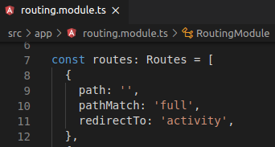
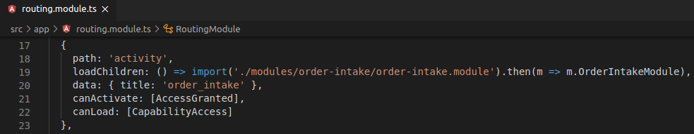

            

# Table of contents
1. [What is BAP?](#BAP)
2. [Installation and deployment](#InstallDeploy)
3. [Skinning](#Skinning)
    1. [Colors](#Colors)
    2. [Graphs](#Graphs)
    3. [Text](#Text)
    4. [Logo](#Logo)
    5. [Routing](#Routing)
    6. [App title and loading screen](#AppTitle)
4. [Translation](#Translate)
    1. [Add new language](#NewLanguage)
    2. [Translate text](#TranslateText)
    3. [Translate data](#TranslateData)
5. [Input data](#Data)
6. [Support](#Support)
  

# 1. What is BAP?

BAP is an interactive dashboard that displays all the data contained in a CSV file or from [IBM Cognos](https://www.ibm.com/products/cognos-analytics) [REST API](https://www.ibm.com/support/knowledgecenter/SSEP7J_11.1.0/com.ibm.swg.ba.cognos.ca_api.doc/swagger_ca.json) in a matter of seconds, granting incredibly low FCP (First Contentful Paint) and TTI (Time To Interactive). Furthermore, the BAP dashboard offers to the user a broad range of different graphics and data display options combined with an atractive and totally customizable interface.

Connecting BAP to IBM Cognos also includes retrieval of access rights and matches them against the shown reports. If IBM Cognos is secured and the user has not authenticated yet, a Login Form is offered.

BAP connects a total of 5 reports with up to 4 drill-levels.

[See it live](https://amvara-consulting.github.io/dashboard_bap.github.io/#/activity)

### Desktop view

### Mobile view

# 2. Installation and deployment
## Installation

Before installing the dashboard, make sure you have all the needed dependencies:
<pre>
sudo apt -y update;
sudo apt-get -y install nodejs;
sudo apt-get -y install npm;
sudo npm install -g npm;
</pre>

Once you have installed everything in the previous step, execute the following:
<pre>
npm install @angular/cli;
npm install json;
npm install --save-dev @angular-devkit/build-angular
</pre>

You might consider not using sudo. We recommend this.

## Development server

Run `ng serve --aot` for a dev server. Navigate to `http://localhost:4200/`. The app will automatically reload if you change any of the source files.

## Code scaffolding

Run `ng generate component component-name` to generate a new component. You can also use `ng generate directive|pipe|service|class|guard|interface|enum|module`.

You can install them using `npm install -g <package_name>`

## Build / Deployment

- The easiest way and interactive compiling `npm start` 
- For more.amvara.rocks `npm run build`
- For Cognos `npm run build-cognos`

## URL Params

If you want to avoid the Access Code inside a production environment you can add ?bypass to the URL to omit it.

# 3. Skinning
In this point we will explain you how to customize the app to your own needs.

## 3.1 Colors
BAP colors can be changed in "./src/app/other/_colors.scss". In said file you can change both color codes and variable names. Furthermore, you can change the previous variables in the respective .scss file.

## 3.2 Graphs
The same way as with the colors, you can change the colors of the graphics. Some of them can be directly modified in the _colors.scss file, while others have to be edited in the .html file containing them.

## 3.3 Text
Changing the text is pretty easy. If you want to hardcode text, go to its respective .html file and change it from there. However, if you want to insert translated text, you can go to point [4.2 Translate text](#TranslateText) to see how to do so.

## 3.4 Logo
You can change the wepbage logo in the "./src/app/components/header/header.component.scss" file. You should keep in mind that the original logo is divided in 3 parts(outer, middle and inner). If you don't want to follow this structure, just put display:hidden in the property you want to hide. If you want to keep the rotating animation, you will also need to adapt the height and width properties to your image scale.

## 3.5 Routing
To rename the main route of each one of the 5 components, first go to "./src/assets/config_common.json" and change the "link" value inside the "reportLinks" array.

Then go to "./src/app/routing.module.ts" and in the first place change the "redirectTo" variable.

Then change all the "path" values you need starting from the third Routes array place.

In order to rename the level rout of each component you need to head to "./src/app/modules". Once inside said folder, you need to change every level variable names in each component folder. As there are some differences in the routing of each component, we will explain how to change all of them.
* Allocation: Change the level variable names inside each level .ts file and inside of "allocation.module.ts".
* Order-backlog: Change the level variable names inside of "services/order-backlog-router.service.ts".
* Order-intake: Change the level variable names inside each level .ts file.
* Plant-stock: Change the level variable names inside each level .ts file and inside of "plant-stock.module.ts".
* Production-program: Change the level variable names inside each level .ts file and inside of "production-program.module.ts".

Note that all the level names must share the same name within each component (e.g. main_route must have the same value inside of each file of the component).

## 3.6 App title and loading screen
The app title can be modified in "./src/assets/config_common.json" changing the "AppTitle" variable to the name of your application. To change the loading screen title, head to "./src/index.html" and put it inside the "title" div.

# 4. Translation
BAP offers the user the ability to translate the webpage into whatever language. To do so, follow the steps:

## 4.1 Add new language
To add and use a new language in BAP go to "./src/assets/config_common.json". In said file, the variable 'languageCodes' contains all the languages the user is going to use. Add the code of the new language. [Click here](https://en.wikipedia.org/wiki/List_of_ISO_639-1_codes) to see all the language codes.

## 4.2 Translate text
Once you have added anew language in the previous step, go to "./src/assets/i18n" and create a new .json file with your language code. Next, add the variables you are going to use.

To insert those variables into an .html file you will need to follow the angular translation structure. \<html_tag>{{ 'variable_name' | translate}}\</html_tag>

## 4.3 Translate data
Translating data is pretty much the same as translating text, but instead of translating variables you will choose which column you want to use. To do so, go to "./src/assets/config_common.json". There, you will see the columns that are in use. To translate the column, simply add the translated column number inside the array.

# 5. Input own data
To input your own data into the dashboard firstly you must understand the hierarchy of the tables and its inner relationships.
* The first thing to understand is the id of each element. In each table you will see a field containing an id with a format similar to 100200. In this case the 100 represents the id of the first level and the 200 represents the id of each child of said level. It is not mandatory to strictly follow this rule but the idea. The id can be whathever you want: 120900000, 209, 3000091... It is only important to respect the `main levels - sub levels structure`.
* Another important thing to keep in mind is the way fields are organized. If you go to "./src/assets/config_common.json" and scroll down to the "columns" array, you will see all the

Here is a little example graphic showing the hierarchies. In this case, the table is used to list all the companies of the specified regions.

Despite the fact that almost all of the tables have the same structure, there are some subtle differences amongst them.

# 6. Support
For further questions or issues, please contact us at our email <tec_dev@amvara.de> or via Discord https://discord.gg/MfuVQrqP
